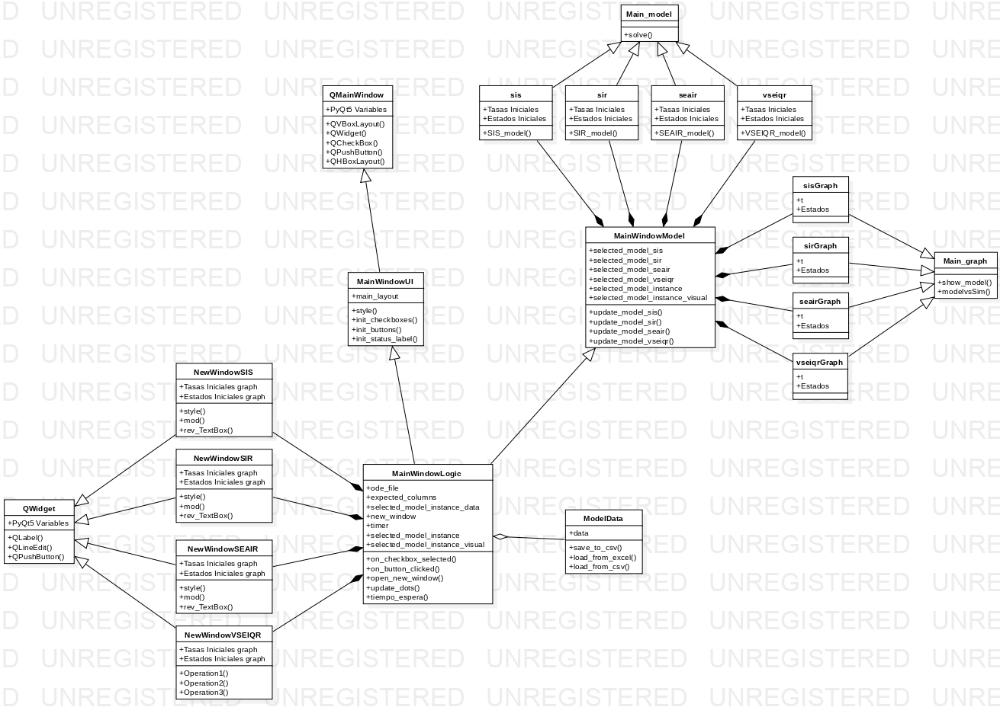

# Episolver

## 📜 **Description**

EpiSolver is an application designed to provide an intuitive interface that enables the execution of numerical solutions for various epidemiological models. 
The application is developed in Python, using PyQt5 for the graphical user interface and scipy.integrate to solve the differential equations by the Runge-Kutta method. 

---

## 🚀 *How to Run the Project*

1. Install dependencies:

   ```bash
   pip install -r requirements.txt
   ```

2. Run the application:

   ```bash
   python main.py
   ```

---

## 🚀 *How to Run the Project in docker*

You need to have a server installed like Xlaunch of vcxsrv

1. Build the image:

   ```bash
   docker build -t bunkfer/episolver .
   ```

2. Run the container:

   ```bash
   docker run -dit --name episolver -e DISPLAY=host.docker.internal:0.0 bunkfer/episolver
   ```

---

## 🖼️ **Appendix**

We created a Docker image that is use as the base for this project.

- PyQt5 = 5.15.11
- matplotlib = 3.10.1
- pandas = 2.2.3
- numpy = 2.2.4
- scipy = 1.15.2

[Base Image](https://hub.docker.com/r/bunkfer/pyqt5)

---

## 📘 **UML Class Diagram**

The following diagram illustrates the class structure of the EpiSolver application, showing the main components and their relationships.



---

## 📚 **References**

- [PyQt5 Documentation](https://www.riverbankcomputing.com/static/Docs/PyQt5/)
- [Scipy.integrate Documentation](https://docs.scipy.org/doc/scipy/reference/generated/scipy.integrate.solve_ivp.html)
- J. Dormand and P. Prince, "A family of embedded runge-kutta formulae," Journal
of Computational and Applied Mathematics, vol. 6, no. 1, pp. 19-26, 1980.
---