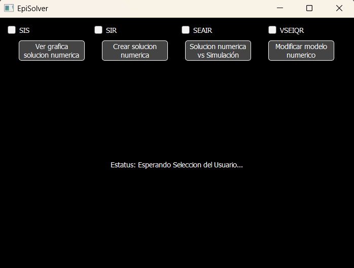

# Epidemic Models Toolkit

This project contains two complementary applications for modeling and analyzing the spread of infectious diseases:

- **Episim** – An agent-based and Markov-chain-based simulator
- **Episolver** – A differential-equation-based solver and comparator

---

## 🧪 Project Structure

EpidemicModel/
├── Episim/                     # Agent-based and Markov chain simulator
│   ├── src/
│   └── Sim03.sln               # Visual Studio solution file for Episim
│
├── Episolver/                  # ODE-based solver and comparison tool
│   ├── Modelos/
│   │   └── Sim_Result.csv      # Simulation results
│   │   └── ODE_Result.csv      # Diferencial equation results
│   └── main.py                 # Script to solve and compare models
│
└── README.md 

---

### 🔹 [Episim](https://github.com/Bunkfer/EpidemicModel/tree/main/Episim)

Episim is a simulation environment built using C# Windows Forms. It implements:

- Agent-based models: to simulate individual-level interactions.
- Markov chains to model probabilistic transitions between epidemiological states.
- A real-time UI to observe the simulation as it runs.
- CSV export of simulation data to:  Episolver/Modelos/Sim_Result.csv

---

### 🔹 [Episolver](https://github.com/Bunkfer/EpidemicModel/tree/main/Episolver)

Episolver is an app built in python-pyqt5. It focuses on solving epidemiological models using differential equations such as:

- SIR, SIS, SEAIR, etc.
- Customizable parameters for infection rate, recovery rate, etc.

It also performs graphical comparison between:

- The analytical/numerical results (`Episolver`)
- The simulation results (`Episim`)

